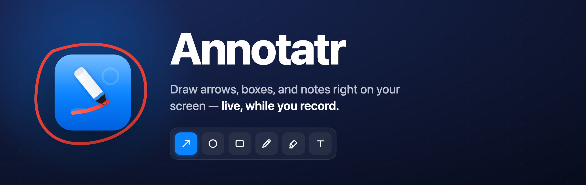
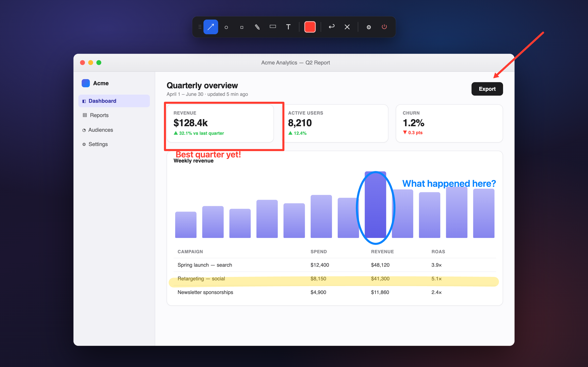
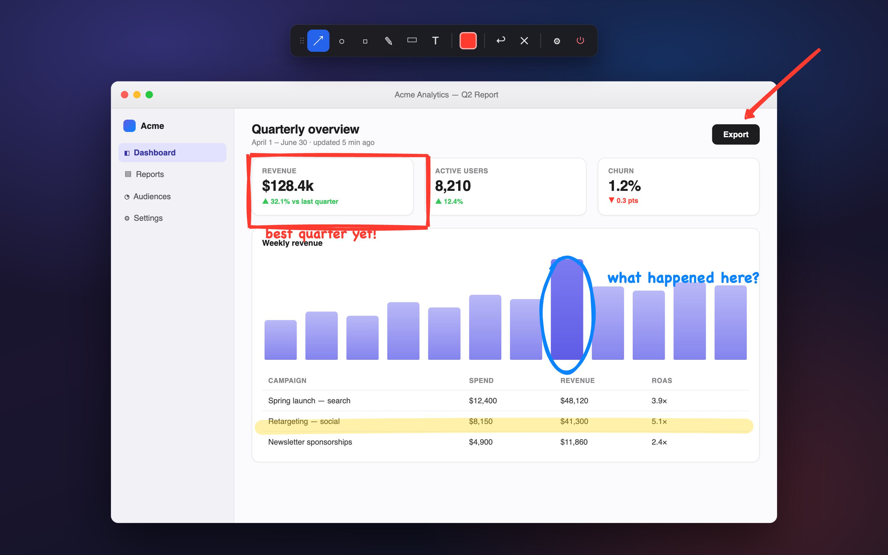
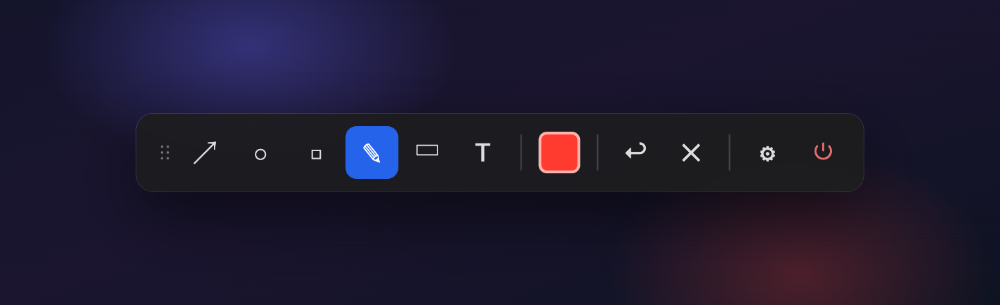
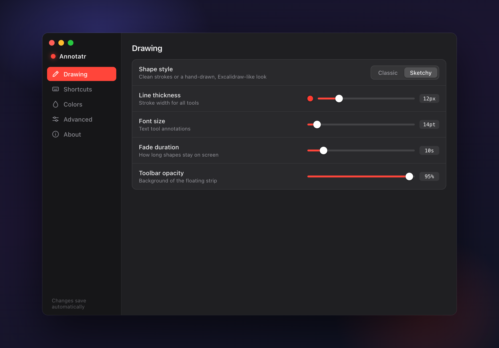

<p align="center">
  
</p>

<p align="center">
  <a href="https://dennisrongo.github.io/annotatr/"><b>Website</b></a> ·
  <a href="https://github.com/dennisrongo/annotatr/releases">Releases</a> ·
  <a href="https://dennisrongo.github.io/annotatr/">Live demo</a>
</p>

<p align="center">
  
  
  
  
</p>

A cross-platform screen annotation overlay tool that lets you draw arrows, circles, boxes, freehand strokes, highlights, and text on your screen in real-time — perfect for tutorials, presentations, and screen recordings with any capture software (OBS, Loom, Zoom, etc.).

<table align="center">
  <tr>
    <td align="center" width="50%">
      <br>
      <sub><b>Classic</b> — clean strokes</sub>
    </td>
    <td align="center" width="50%">
      <br>
      <sub><b>Sketchy</b> — hand-drawn, powered by rough.js</sub>
    </td>
  </tr>
</table>

<p align="center"><em>Summon the toolbar with a hotkey, draw live over any app, and let shapes fade away on their own — <a href="https://dennisrongo.github.io/annotatr/">try the live demo</a>.</em></p>

## Features

- **6 Drawing Tools**: Arrow, Circle, Box, Freehand, Highlighter, and Text
- **Two Shape Styles**: Classic clean strokes, or a hand-drawn Excalidraw-like "Sketchy" look (powered by rough.js)
- **Floating Toolbar**: Compact draggable strip with tool buttons, color swatch, undo, and clear — summoned by a global hotkey without stealing focus from the app you're recording
- **Global Hotkeys**: Configurable shortcuts for the toolbar and every tool, with system-conflict detection
- **Auto-Fade**: Shapes fade out smoothly after a configurable duration, leaving the screen clean
- **Shape Editing**: Toggle edit mode to click any shape and change its color, thickness, or font size — or delete it
- **Per-Tool Customization**: Independent color for each tool, adjustable line thickness and font size
- **Multi-Monitor Support**: The overlay follows your cursor's monitor; shapes stay confined to the monitor they were drawn on
- **Retina/HiDPI Aware**: Crisp rendering on high-density displays
- **Settings Import/Export**: Back up your configuration as JSON or move it between machines
- **Cross-Platform**: Windows, macOS, and Linux

## Prerequisites

- **Node.js** (v18 or higher) - [Download](https://nodejs.org/)
- **Rust** - [Install via rustup](https://rustup.rs/)
- **Platform-specific build tools**:
  - **macOS**: Xcode Command Line Tools (`xcode-select --install`)
  - **Windows**: Microsoft C++ Build Tools
  - **Linux**: Refer to your distro's documentation for WebKit2GTK dependencies

## Quick Start

1. Clone the repository:
   ```bash
   git clone https://github.com/dennisrongo/annotatr.git
   cd annotatr
   ```

2. Run the initialization script:
   ```bash
   ./init.sh
   ```

   This checks prerequisites, installs dependencies, and starts the development server.

   Or manually:

   ```bash
   npm install
   npm run tauri:dev
   ```

## Usage

### Drawing

1. **Summon the toolbar**: press `Ctrl+Shift+D`. The floating strip appears without taking focus from your current app.
2. **Pick a tool**: click a toolbar button or press the tool's global hotkey — this activates the drawing overlay.
3. **Draw**: click and drag to create shapes. A live preview follows your cursor.
   - **Text**: click to place the cursor, type (Shift+Enter for new lines), press Enter to commit.
4. **Done**: press `Escape` to dismiss the overlay, or `Ctrl+Shift+D` to toggle the toolbar away. Shapes fade out on their own after the configured duration.

### Toolbar

<p align="center">
  
</p>

- **Drag** the `⋮⋮` handle (or the strip background) to move it; the position is remembered
- **Color swatch** changes the active tool's color on the fly
- **↩ / ✕** undo the last shape or clear all shapes
- **⚙** opens the Settings window, **⏻** quits the app
- Set the strip's opacity in Settings, or park it off-screen to keep it out of recordings

### While the Overlay Is Active

| Action | Shortcut |
|--------|----------|
| Cancel in-progress shape / dismiss overlay | `Escape` |
| Undo last shape | `Ctrl/Cmd+Z` |
| Clear all shapes | `Ctrl/Cmd+Shift+X` |
| Toggle edit mode (click a shape to restyle or delete it) | `Ctrl/Cmd+E` |

### Settings

<p align="center">
  
</p>

The Settings window (gear icon on the toolbar) is organized into tabs:

- **Drawing**: shape style (Classic / Sketchy), line thickness, font size, fade duration, toolbar opacity
- **Shortcuts**: rebind any global hotkey; warns about combos already used by the OS
- **Colors**: per-tool color from presets or a custom picker
- **Advanced**: arrow head style (filled / open / double-headed), settings export/import, reset to defaults

All changes save automatically and apply immediately.

## Default Hotkeys

| Action | Hotkey |
|--------|--------|
| Toggle Toolbar | `Ctrl+Shift+D` |
| Arrow Tool | `Ctrl+Shift+A` |
| Circle Tool | `Ctrl+Shift+C` |
| Box Tool | `Ctrl+Shift+B` |
| Freehand Tool | `Ctrl+Shift+F` |
| Highlighter Tool | `Ctrl+Shift+H` |
| Text Tool | `Ctrl+Shift+T` |

## Development

### Project Structure

```
annotatr/
├── src/                  # Frontend (React + TypeScript)
│   ├── main.tsx          # Settings window entry
│   ├── panel-main.tsx    # Floating toolbar entry
│   ├── overlay-entry.tsx # Drawing overlay entry
│   ├── App.tsx           # Settings window UI
│   ├── components/       # Overlay and Toolbar components
│   ├── lib/              # Drawing, storage, and shape-editing utilities
│   └── types/            # Shared shape/type definitions
├── src-tauri/            # Backend (Rust, Tauri 2)
│   ├── src/              # Window management, hotkeys, persistence
│   └── Cargo.toml        # Rust dependencies
├── init.sh               # Development setup script
└── README.md             # This file
```

The app runs as three Tauri windows: the **settings window**, the **floating toolbar**, and a transparent fullscreen **overlay** where shapes are drawn.

### Available Scripts

- `npm run tauri:dev` - Start the app in development mode
- `npm run tauri:build` - Build production binaries
- `npm run dev` / `npm run build` - Frontend-only Vite dev server / build

### Building for Production

```bash
npm run tauri:build
```

Built binaries land in `src-tauri/target/release/bundle/`. This is an **unsigned** build for local testing — Gatekeeper will warn other users it's from an unidentified developer.

> Auto-update artifacts are enabled (`bundle.createUpdaterArtifacts`), so `tauri build` needs the updater signing key in the environment (`TAURI_SIGNING_PRIVATE_KEY`). The release script below sets this for you; for a quick local build without it, temporarily set `createUpdaterArtifacts` to `false`.

### Distributing a Signed & Notarized macOS DMG

To produce a universal (Intel + Apple Silicon) DMG that opens cleanly on any Mac — and that existing installs can auto-update to — you need an Apple Developer account with a **Developer ID Application** certificate in your keychain.

1. **Create an app-specific password** at [appleid.apple.com](https://appleid.apple.com) → *Sign-In and Security → App-Specific Passwords* (this is **not** your Apple ID login password).

2. **Add your credentials** — copy the template and fill it in:

   ```bash
   cp .env.release.example .env.release
   ```

   `.env.release` is gitignored; never commit it. List your signing identities with `security find-identity -v -p codesigning`, and generate the one-time updater key with `npx tauri signer generate -w ~/.tauri/annotatr-updater.key -p "" --ci` (**back this key up** — losing it breaks auto-update for installed copies).

3. **Build, sign, notarize, and publish:**

   ```bash
   ./scripts/release-mac.sh            # signed/notarized DMG + latest.json, locally
   ./scripts/release-mac.sh --publish  # also create/upload the GitHub release
   ```

   The script builds universal, signs with the hardened runtime, notarizes + staples, generates the per-arch `latest.json` updater manifest, and (with `--publish`) creates the GitHub release. The distributable DMG is e.g. `…/bundle/dmg/Annotatr_0.1.0_universal.dmg`.

**Auto-updates:** the Settings window checks `https://github.com/dennisrongo/annotatr/releases/latest/download/latest.json` on launch and shows an "Update & restart" banner when a newer signed build is available. To ship one, bump the version in `package.json`, `src-tauri/Cargo.toml`, and `src-tauri/tauri.conf.json`, then run `./scripts/release-mac.sh --publish`. The repo must stay **public** for the endpoint and DMG links to resolve. See [docs/RELEASE.md](docs/RELEASE.md) for the full runbook.

> **Note:** Annotatr uses macOS private APIs for its transparent overlay (`macOSPrivateApi`), so it is distributed via Developer ID + notarization rather than the Mac App Store.

## Technology Stack

- **Frontend**: React 18 with TypeScript (Vite)
- **Sketchy rendering**: [rough.js](https://roughjs.com/)
- **Backend**: Tauri 2 (Rust)
- **Storage**: Tauri persistent storage (settings survive restarts)

## License

MIT

## Contributing

Contributions are welcome! Please feel free to submit a Pull Request.

## Support

For issues, questions, or suggestions, please open an issue on GitHub.

---

Made with ❤️ for screen recording enthusiasts by [Dennis Rongo](https://dennisrongo.com)
